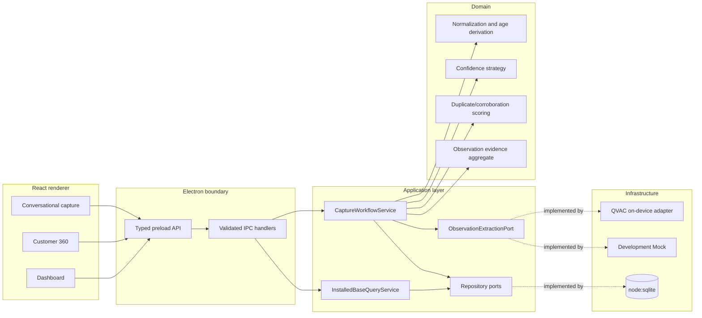
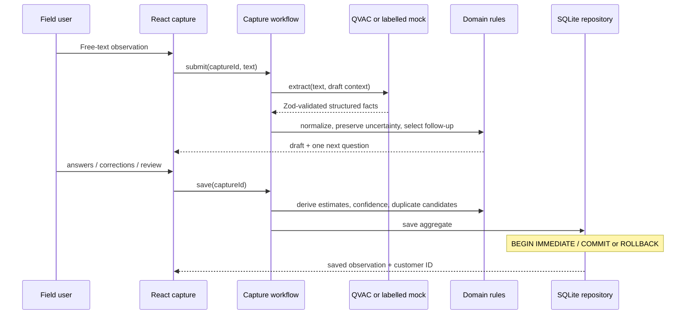

# Architecture

## Shape of the vertical slice

The dependency direction is inward: Electron/UI adapters depend on application ports and use cases, which depend on domain concepts. QVAC and SQLite are replaceable infrastructure implementations rather than domain dependencies.

The renderer has no Node integration and cannot invoke arbitrary Electron channels. `contextIsolation` and the renderer sandbox are enabled; preload exposes a narrow typed API. IPC payloads are parsed with Zod before a use case is called.

## Capture and save flow

The conversational state is deliberately ephemeral until save. Once saved, the `ObservationSession`, `EvidenceItem`, and `EquipmentObservation` records are inserted together in one transaction. A failure in any equipment row rolls the complete write back.

## Evidence and projection

An observation describes what one observer reported during one visit, not an unquestionable current truth. Each equipment field carries knowledge state, origin, certainty, and evidence IDs. Raw text is retained as evidence; inference tokens and hidden reasoning are not logged.

The Customer 360 read model is a projection over immutable observations. `latest-per-signature-v1` groups by modality/manufacturer/model signature and selects the latest group while returning contributing observation IDs. This keeps the current UI useful without destroying the audit trail.

Duplicate scoring first requires the same customer and a compatible known modality. Manufacturer, model, and numeric age compatibility adjust a transparent score. Independent observers/visits can classify a candidate as possible corroboration; conflicting facts are surfaced as possible conflict. All outcomes remain review candidates, never automatic merges.

## Local data and migrations

`LocalSqliteDatabase` wraps Node's built-in `node:sqlite`, enables foreign keys and WAL, and owns explicit transactions. Migration `001` creates customers, sessions, evidence, equipment observations, evidence links, duplicate candidates, and seed imports. JSON is used only for bounded typed value objects such as age, confidence, and provenance.

The seed is guarded by `synthetic-development-v1`, so reopening the application or rerunning the seed does not duplicate fixtures.

## Extension seams

- `ObservationExtractionPort`: additional local inference engines can be added without changing capture rules.
- `SpeechToTextPort`: reserved for local voice transcription; the UI currently labels voice as unavailable.
- `EvidenceSource`: already includes Text, Voice, and Photo so later sources can attach to the same immutable session.
- `ConfidenceScoringService`: `confidence-v1` can be replaced/versioned while stored explanations remain interpretable.
- repository/query ports: allow projection or persistence evolution without coupling the domain to SQLite.

No remote sync or delegated inference is implied by these seams.
