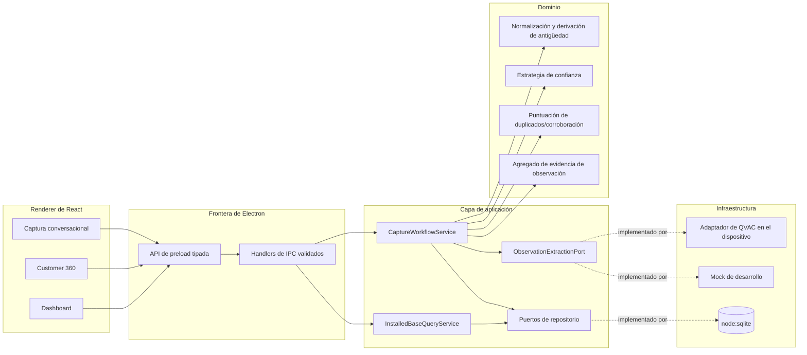
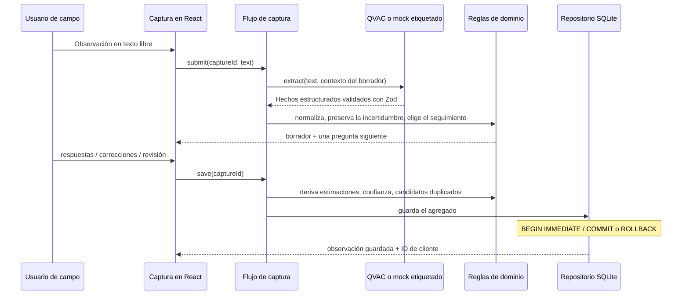

# Arquitectura

## Forma del corte vertical

La dirección de las dependencias es hacia adentro: los adaptadores de Electron/UI dependen de los puertos y casos de uso de la aplicación, que a su vez dependen de conceptos de dominio. QVAC y SQLite son implementaciones de infraestructura reemplazables, no dependencias del dominio.

El renderer no tiene integración con Node y no puede invocar canales arbitrarios de Electron. `contextIsolation` y el sandbox del renderer están habilitados; el preload expone una API tipada acotada. Los payloads de IPC se parsean con Zod antes de invocar un caso de uso.

## Flujo de captura y guardado

El estado conversacional es deliberadamente efímero hasta el guardado. Una vez guardado, los registros `ObservationSession`, `EvidenceItem` y `EquipmentObservation` se insertan juntos en una sola transacción. Un fallo en cualquier fila de equipo revierte la escritura completa.

## Evidencia y proyección

Una observación describe lo que un observador reportó durante una visita, no una verdad actual incuestionable. Cada campo de equipo lleva estado de conocimiento, origen, certeza e IDs de evidencia. El texto crudo se conserva como evidencia; los tokens de inferencia y el razonamiento oculto no se registran en logs.

El modelo de lectura Customer 360 es una proyección sobre observaciones inmutables. `latest-per-signature-v1` agrupa por firma de modalidad/fabricante/modelo y selecciona el grupo más reciente, devolviendo los IDs de observación que contribuyeron. Esto mantiene la interfaz actual útil sin destruir el rastro de auditoría.

La puntuación de duplicados requiere primero el mismo cliente y una modalidad conocida compatible. La compatibilidad de fabricante, modelo y antigüedad numérica ajusta un puntaje transparente. Observadores/visitas independientes pueden clasificar un candidato como posible corroboración; los hechos contradictorios se marcan como posible conflicto. Todos los resultados siguen siendo candidatos de revisión, nunca fusiones automáticas.

## Datos locales y migraciones

`LocalSqliteDatabase` envuelve el `node:sqlite` incorporado de Node, habilita claves foráneas y WAL, y gestiona transacciones explícitas. La migración `001` crea las tablas de clientes, sesiones, evidencia, observaciones de equipo, vínculos de evidencia, candidatos duplicados e importaciones de semilla. JSON se usa solo para objetos de valor tipados y acotados, como antigüedad, confianza y procedencia.

La semilla está protegida por `synthetic-development-v1`, de modo que reabrir la aplicación o volver a ejecutar la semilla no duplica los fixtures.

## Puntos de extensión

- `ObservationExtractionPort`: se pueden agregar motores de inferencia local adicionales sin cambiar las reglas de captura.
- `SpeechToTextPort`: reservado para transcripción de voz local; la interfaz actualmente etiqueta la voz como no disponible.
- `EvidenceSource`: ya incluye Text, Voice y Photo, de modo que fuentes futuras puedan adjuntarse a la misma sesión inmutable.
- `ConfidenceScoringService`: `confidence-v1` puede reemplazarse/versionarse mientras las explicaciones almacenadas siguen siendo interpretables.
- puertos de repositorio/consulta: permiten evolucionar la proyección o la persistencia sin acoplar el dominio a SQLite.

Ninguno de estos puntos de extensión implica sincronización remota ni inferencia delegada.

## Responsabilidades de los módulos

| Ruta                              | Responsabilidad                                                                                                                                                                 | ¿Puede importar `@qvac/sdk`? | ¿Puede importar Electron? |
| --------------------------------- | ------------------------------------------------------------------------------------------------------------------------------------------------------------------------------- | ---------------------------- | ------------------------- |
| `src/domain/`                     | Entidades, objetos de valor y reglas puras: normalización, derivación de antigüedad e instalación, puntuación de confianza, puntuación de duplicados, selección de seguimientos | no                           | no                        |
| `src/application/contracts/`      | Esquemas de Zod y tipos de vista que cruzan la frontera, incluyendo el esquema de extracción                                                                                    | no                           | no                        |
| `src/application/ports/`          | Interfaces que la infraestructura debe implementar: extracción, repositorios, reloj, ids, voz a texto                                                                           | no                           | no                        |
| `src/application/prompts/`        | El prompt del sistema de extracción y el constructor de prompts                                                                                                                 | no                           | no                        |
| `src/application/use-cases/`      | `CaptureWorkflowService` e `InstalledBaseQueryService`                                                                                                                          | no                           | no                        |
| `src/infrastructure/qvac/`        | El adaptador de QVAC, el único punto de llamada al SDK                                                                                                                          | **sí**                       | no                        |
| `src/infrastructure/mock/`        | El adaptador determinista del Mock de desarrollo                                                                                                                                | no                           | no                        |
| `src/infrastructure/persistence/` | Base de datos `node:sqlite`, migraciones, repositorio                                                                                                                           | no                           | no                        |
| `src/infrastructure/seed/`        | Fixtures sintéticos idempotentes                                                                                                                                                | no                           | no                        |
| `src/infrastructure/platform/`    | Reloj del sistema y generación de ids                                                                                                                                           | no                           | no                        |
| `src/main/`                       | Ventana, composition root, registro de IPC                                                                                                                                      | no                           | **sí**                    |
| `src/preload/`                    | El puente tipado acotado                                                                                                                                                        | no                           | **sí**                    |
| `src/renderer/`                   | UI de React. Sin Node, sin sistema de archivos, sin SDK                                                                                                                         | no                           | no                        |
| `src/shared/`                     | Nombres de canales IPC, esquemas de solicitud, el tipo de la API                                                                                                                | no                           | no                        |

Los prompts y el esquema de extracción viven deliberadamente en la capa de aplicación. Describen
qué quiere extraer el negocio, no cómo se invoca un motor, de modo que cambiar de motor no debe
reescribirlos. Ver [QVAC_ARCHITECTURE.md](QVAC_ARCHITECTURE.md) para las reglas específicas de QVAC y
[DATA_SCHEMA.md](DATA_SCHEMA.md) para el significado de los registros.

## No implementado — PLANIFICADO

Se marca aquí para que nada en este documento se lea como una descripción de código funcional.

- **Captura de voz y voz a texto.** `SpeechToTextPort` existe en
  `src/application/ports/platform.ts` sin implementación. `EvidenceSource` incluye `Voice`
  y la base de datos lo acepta, pero ningún adaptador lo produce. La interfaz etiqueta la voz como no disponible.
- **Evidencia fotográfica y OCR.** `Photo` está igualmente tipado y sin implementar.
- **Un propietario compartido del runtime de QVAC.** Hoy un solo adaptador gestiona el worker y el modelo. Se recomienda un
  propietario compartido en QVAC_ARCHITECTURE.md, pero no debería construirse antes de que exista una segunda
  capacidad.
- **Política de vigencia y antigüedad.** Se calculan los días transcurridos; la clasificación permanece
  desconocida porque no se suministraron umbrales de negocio.
- **Analítica en lenguaje natural, autenticación, sincronización multiusuario, fusión automática de
  entidades, empaquetado de modelos, instaladores de producción.** Todo queda fuera de este corte vertical.
- **Cifrado de la base de datos en reposo.** Ver [PRIVACY_OFFLINE.md](PRIVACY_OFFLINE.md) y
  la decisión 14 en [DECISIONS.md](DECISIONS.md).
