# Arquitectura de QVAC

Cómo participa QVAC en esta aplicación, y las reglas que lo mantienen contenido.

Para el inventario de cumplimiento (versión del SDK, plugin, modelo, salida estructurada, postura
de red) ver [QVAC_COMPLIANCE.md](QVAC_COMPLIANCE.md). Para la forma general del sistema ver
[ARCHITECTURE.md](ARCHITECTURE.md). Este documento cubre ubicación, fronteras y ciclo de vida.

## Dónde puede vivir QVAC

```mermaid
flowchart TB
  R[Renderer<br/>React] -->|preload tipado| I[Handlers de IPC<br/>validados con Zod]
  I --> W[CaptureWorkflowService<br/>application]
  I --> VT[voice-transcription.ts<br/>main, solo ciclo de vida de archivo temporal]
  W --> P[[ObservationExtractionPort<br/>application/ports]]
  VT --> ST[[SpeechToTextPort<br/>application/ports]]
  P -. implementado por .-> Q[QvacObservationExtractionService<br/>infrastructure/qvac]
  P -. implementado por .-> M[DevelopmentMockObservationExtractionService<br/>infrastructure/mock]
  ST -. implementado por .-> QS[QvacSpeechToTextService<br/>infrastructure/qvac]
  ST -. implementado por .-> MS[DevelopmentMockSpeechToTextService<br/>infrastructure/mock]
  Q --> SDK([&#64;qvac/sdk])
  QS --> SDK
  W --> D[Reglas de dominio]

  style Q fill:#fff3cd,stroke:#856404
  style QS fill:#fff3cd,stroke:#856404
  style SDK fill:#f8d7da,stroke:#721c24
```



**Solo `src/infrastructure/qvac/**` puede importar `@qvac/sdk`.** Todo lo que está por encima depende de
`ObservationExtractionPort` o `SpeechToTextPort`. Esta es la regla que hace posible el mock, las
pruebas y cualquier motor futuro, y la verifica la skill `qvac-review`.

Una auditoría rápida:

```bash
grep -rln "@qvac/sdk" src/
# esperado: solo archivos bajo src/infrastructure/qvac/
#   (qvac-observation-extraction.ts y qvac-speech-to-text.ts a partir de la capacidad de voz)
```

## Composición

`src/main/composition-root.ts` es el único lugar que decide qué implementación se
construye. Lee `CIB_INFERENCE_MODE`, cuyo valor por defecto es `mock` en una ejecución de
desarrollo sin empaquetar y `qvac` en una empaquetada. Nada más en la aplicación sabe qué motor está
activo; solo lee el contrato de información de runtime.

## Runtime y worker

`heartbeat()` inicia o verifica el worker local de QVAC. El worker carga solo los plugins
listados en `qvac.config.json`, actualmente solo `@qvac/sdk/llamacpp-completion/plugin`. El worker
se ejecuta en el lado del proceso principal de Electron de la frontera, nunca en el renderer. El renderer tiene
`contextIsolation` activado, `nodeIntegration` desactivado y `sandbox` activado, de modo que no puede alcanzar el SDK
ni siquiera en principio.

## Ciclo de vida del modelo

La secuencia completa, tal como está implementada en `QvacObservationExtractionService`:

| Fase              | Llamada                           | Estado de runtime mostrado al usuario         |
| ----------------- | --------------------------------- | --------------------------------------------- |
| Inactivo          | ninguna                           | `model-not-loaded`                            |
| Iniciar runtime   | `heartbeat()`                     | `loading`                                     |
| Adquirir modelo   | `loadModel({ ... onProgress })`   | `downloading` con porcentaje, luego `loading` |
| Verificar handler | `getLoadedModelInfo({ modelId })` | `loading`                                     |
| Listo             | —                                 | `ready`                                       |
| Inferencia        | `completion({ ... })`             | `processing`, luego vuelve a `ready`          |
| Fallo             | —                                 | `error` con el mensaje                        |
| Apagado           | `unloadModel({ modelId })`        | `model-not-loaded`                            |

Reglas:

- **La inicialización es explícita.** El usuario la solicita. Nunca ocurre como un efecto
  secundario oculto de escribir.
- **Cargar una vez, reutilizar.** `initialize()` retorna anticipadamente si `modelId` ya está definido. Cargar por
  cada solicitud sería un defecto.
- **Descargar al liberar recursos.** `dispose()` descarga el modelo y está conectado al `dispose()` del composition root,
  al que llama el proceso principal en `before-quit`.
- **Un modelo a la vez**, por ahora. Un segundo modelo residente necesita una cifra de RAM medida y una
  entrada en [MODEL_STRATEGY.md](MODEL_STRATEGY.md).

## Streaming

`completion` se llama con `stream: true`. El adaptador drena `run.events` y luego espera
`run.final`. Drenar es parte del ciclo de vida, no una optimización.

Los deltas de tokens deliberadamente **no** se muestran en la interfaz y **no** se registran en logs. La salida es un
documento JSON, así que un objeto parcialmente transmitido no tiene una representación intermedia útil, y
registrar los deltas escribiría contenido de observaciones hospitalarias en disco. Si más adelante se desea
retroalimentación incremental en la interfaz, transmita una señal de progreso, no contenido.

## Manejo de fallos

- Un fallo de inicialización limpia `modelId`, establece `error` con el mensaje, y relanza la excepción. La
  aplicación no reintenta silenciosamente.
- Un fallo de inferencia establece `error` y relanza la excepción.
- **No existe respaldo hacia el mock de desarrollo.** La identidad del motor que muestra la interfaz es
  siempre el motor que realmente se ejecutó. Esta es una regla estricta; una degradación silenciosa haría que
  cada captura de pantalla y cada registro guardado fueran poco confiables.
- Prefiera los tipos de error exportados por el SDK (`ContextOverflowError`, `WorkerCrashedError`,
  `InferenceCancelledError`, y los mapas `SDK_*_ERROR_CODES`) antes que comparar cadenas de mensaje.

## Separación entre código de negocio y código de QVAC

| Aspecto               | Vive en                                   | ¿Puede importar `@qvac/sdk`?    |
| --------------------- | ----------------------------------------- | ------------------------------- |
| Prompts               | `src/application/prompts/`                | no                              |
| Esquema de extracción | `src/application/contracts/extraction.ts` | no                              |
| Definición de puertos | `src/application/ports/`                  | no                              |
| Reglas del flujo      | `src/application/use-cases/`              | no                              |
| Reglas de dominio     | `src/domain/`                             | no                              |
| Adaptador de QVAC     | `src/infrastructure/qvac/`                | **sí**                          |
| Adaptador mock        | `src/infrastructure/mock/`                | no                              |
| Cableado              | `src/main/composition-root.ts`            | no, solo construye el adaptador |

Los prompts y los esquemas viven deliberadamente en la capa de aplicación: describen qué
quiere extraer el negocio, no cómo se invoca un motor en particular. Cambiar de motor no debe reescribirlos.

## Cómo agregar una nueva capacidad de QVAC

La captura de voz (voz a texto) siguió esta forma y ya está implementada:

1. Un puerto en `src/application/ports/`. `SpeechToTextPort` (`platform.ts`) refleja
   el ciclo de vida de `ObservationExtractionPort` (`initialize`/`getRuntimeInfo`/`transcribe`/`dispose`).
2. Un adaptador en `src/infrastructure/qvac/qvac-speech-to-text.ts` que lo implementa, más
   `DevelopmentMockSpeechToTextService` en `src/infrastructure/mock/` para paridad de desarrollo/pruebas con la
   capacidad de extracción.
3. El plugin que el motor necesita, `@qvac/sdk/whispercpp-transcription/plugin`, añadido a
   `qvac.config.json` junto al plugin de completado ya existente — no se habilitó ningún otro plugin.
4. Su propio ciclo de vida de modelo: cargado de forma diferida en el primer uso en lugar de anticipadamente, descargado al
   liberar recursos de la aplicación. **Aún no satisfecho:** la coexistencia con el modelo de completado no se ha
   medido en cuanto a RAM — ver "Preguntas abiertas" de la Capacidad 2 en `docs/MODEL_STRATEGY.md`.

La próxima capacidad debería seguir la misma forma. No agregue un segundo punto de llamada directo al SDK
en otro lugar de la aplicación.

## Recomendación, aún no implementada

**PLANIFICADO — un propietario compartido del runtime de QVAC.** La segunda capacidad ya llegó:
`QvacObservationExtractionService` y `QvacSpeechToTextService` cada uno llama de forma independiente a
`heartbeat()`, `loadModel` y `unloadModel`, exactamente la duplicación que anticipaba esta sección.
`heartbeat()` en sí es idempotente (inicia o verifica un único worker), así que esto no es actualmente un
defecto de corrección, pero la residencia del modelo ahora se rastrea en dos lugares sin una vista compartida — que es
también por qué la pregunta de coexistencia de RAM en `docs/MODEL_STRATEGY.md` sigue abierta. La forma
recomendada sigue siendo un pequeño objeto `QvacRuntime` en `src/infrastructure/qvac/` que posea el arranque
del worker, un registro de ids de modelos cargados, y la liberación de recursos, con cada adaptador de capacidad tomando prestado
un modelo de él.

Esto no se construyó como parte de agregar la voz: hacerlo habría mezclado una refactorización con un cambio
de funcionalidad. Constrúyalo la próxima vez que se agregue una tercera capacidad, o antes si la pregunta de RAM de
arriba se mide y resulta requerir una descarga coordinada.
