# QVAC architecture

How QVAC participates in this application, and the rules that keep it contained.

For the compliance inventory (SDK version, plugin, model, structured output, network posture)
see [QVAC_COMPLIANCE.md](QVAC_COMPLIANCE.md). For the overall system shape see
[ARCHITECTURE.md](ARCHITECTURE.md). This document covers placement, boundaries, and lifecycle.

## Where QVAC is allowed to live

```mermaid
flowchart TB
  R[Renderer<br/>React] -->|typed preload| I[IPC handlers<br/>Zod validated]
  I --> W[CaptureWorkflowService<br/>application]
  I --> VT[voice-transcription.ts<br/>main, temp-file lifecycle only]
  W --> P[[ObservationExtractionPort<br/>application/ports]]
  VT --> ST[[SpeechToTextPort<br/>application/ports]]
  P -. implemented by .-> Q[QvacObservationExtractionService<br/>infrastructure/qvac]
  P -. implemented by .-> M[DevelopmentMockObservationExtractionService<br/>infrastructure/mock]
  ST -. implemented by .-> QS[QvacSpeechToTextService<br/>infrastructure/qvac]
  ST -. implemented by .-> MS[DevelopmentMockSpeechToTextService<br/>infrastructure/mock]
  Q --> SDK([&#64;qvac/sdk])
  QS --> SDK
  W --> D[Domain rules]

  style Q fill:#fff3cd,stroke:#856404
  style QS fill:#fff3cd,stroke:#856404
  style SDK fill:#f8d7da,stroke:#721c24
```



**Only `src/infrastructure/qvac/**` may import `@qvac/sdk`.** Everything above it depends on
`ObservationExtractionPort` or `SpeechToTextPort`. This is the rule that makes the mock, the
tests, and any future engine possible, and it is checked by the `qvac-review` skill.

A quick audit:

```bash
grep -rln "@qvac/sdk" src/
# expected: only files under src/infrastructure/qvac/
#   (qvac-observation-extraction.ts and qvac-speech-to-text.ts as of the voice capability)
```

## Composition

`src/main/composition-root.ts` is the only place that decides which implementation is
constructed. It reads `CIB_INFERENCE_MODE`, defaulting to `mock` in an unpackaged development
run and `qvac` in a packaged one. Nothing else in the application knows which engine is active;
it only reads the runtime info contract.

## Runtime and worker

`heartbeat()` starts or verifies the local QVAC worker. The worker loads only the plugins
listed in `qvac.config.json`, currently just `@qvac/sdk/llamacpp-completion/plugin`. The worker
runs in the Electron main process side of the boundary, never in the renderer. The renderer has
`contextIsolation` on, `nodeIntegration` off, and `sandbox` on, so it cannot reach the SDK even
in principle.

## Model lifecycle

The full sequence, as implemented in `QvacObservationExtractionService`:

| Phase          | Call                              | Runtime status shown to the user           |
| -------------- | --------------------------------- | ------------------------------------------ |
| Idle           | none                              | `model-not-loaded`                         |
| Start runtime  | `heartbeat()`                     | `loading`                                  |
| Acquire model  | `loadModel({ ... onProgress })`   | `downloading` with percent, then `loading` |
| Verify handler | `getLoadedModelInfo({ modelId })` | `loading`                                  |
| Ready          | —                                 | `ready`                                    |
| Inference      | `completion({ ... })`             | `processing`, then back to `ready`         |
| Failure        | —                                 | `error` with the message                   |
| Shutdown       | `unloadModel({ modelId })`        | `model-not-loaded`                         |

Rules:

- **Initialization is explicit.** The user asks for it. It never happens as a hidden side
  effect of typing.
- **Load once, reuse.** `initialize()` returns early if `modelId` is already set. Loading per
  request would be a defect.
- **Unload on disposal.** `dispose()` unloads and is wired into the composition root's
  `dispose()`, which the main process calls on `before-quit`.
- **One model at a time** for now. A second resident model needs a measured RAM figure and an
  entry in [MODEL_STRATEGY.md](MODEL_STRATEGY.md).

## Streaming

`completion` is called with `stream: true`. The adapter drains `run.events` and then awaits
`run.final`. Draining is part of the lifecycle, not an optimisation.

Token deltas are deliberately **not** surfaced to the UI and **not** logged. The output is a
JSON document, so a partially streamed object has no useful intermediate rendering, and logging
deltas would write hospital observation content to disk. If incremental UI feedback is wanted
later, stream a progress signal, not content.

## Failure handling

- Initialization failure clears `modelId`, sets `error` with the message, and rethrows. The
  application does not retry silently.
- Inference failure sets `error` and rethrows.
- **There is no fallback to the development mock.** The engine identity the UI displays is
  always the engine that actually ran. This is a hard rule; a silent downgrade would make every
  screenshot and every saved record untrustworthy.
- Prefer the SDK's exported error types (`ContextOverflowError`, `WorkerCrashedError`,
  `InferenceCancelledError`, and the `SDK_*_ERROR_CODES` maps) over matching message strings.

## Separation of business code and QVAC code

| Concern           | Lives in                                  | May import `@qvac/sdk`          |
| ----------------- | ----------------------------------------- | ------------------------------- |
| Prompts           | `src/application/prompts/`                | no                              |
| Extraction schema | `src/application/contracts/extraction.ts` | no                              |
| Port definition   | `src/application/ports/`                  | no                              |
| Workflow rules    | `src/application/use-cases/`              | no                              |
| Domain rules      | `src/domain/`                             | no                              |
| QVAC adapter      | `src/infrastructure/qvac/`                | **yes**                         |
| Mock adapter      | `src/infrastructure/mock/`                | no                              |
| Wiring            | `src/main/composition-root.ts`            | no, constructs the adapter only |

Prompts and schemas sit in the application layer on purpose: they describe what the business
wants extracted, not how a particular engine is called. Swapping engines must not rewrite them.

## Adding a new QVAC capability

Voice capture (speech to text) followed this shape and is now implemented:

1. A port in `src/application/ports/`. `SpeechToTextPort` (`platform.ts`) mirrors
   `ObservationExtractionPort`'s lifecycle (`initialize`/`getRuntimeInfo`/`transcribe`/`dispose`).
2. An adapter in `src/infrastructure/qvac/qvac-speech-to-text.ts` implementing it, plus
   `DevelopmentMockSpeechToTextService` in `src/infrastructure/mock/` for dev/test parity with the
   extraction capability.
3. The plugin the engine needs, `@qvac/sdk/whispercpp-transcription/plugin`, added to
   `qvac.config.json` alongside the existing completion plugin — no other plugin was enabled.
4. Its own model lifecycle: loaded lazily on first use rather than eagerly, unloaded on
   application disposal. **Not yet satisfied:** coexistence with the completion model has not
   been measured for RAM — see `docs/MODEL_STRATEGY.md`'s Capability 2 "Open questions".

The next capability should follow the same shape. Do not add a second direct SDK call site
elsewhere in the app.

## Recommendation, not yet implemented

**PLANNED — a shared QVAC runtime owner.** The second capability has now arrived:
`QvacObservationExtractionService` and `QvacSpeechToTextService` each independently call
`heartbeat()`, `loadModel`, and `unloadModel`, exactly the duplication this section anticipated.
`heartbeat()` itself is idempotent (it starts-or-verifies one worker), so this is not currently a
correctness bug, but model residency is now tracked in two places with no shared view — which is
also why the RAM-coexistence question in `docs/MODEL_STRATEGY.md` remains open. The recommended
shape is still a small `QvacRuntime` object in `src/infrastructure/qvac/` that owns worker
startup, a registry of loaded model ids, and disposal, with each capability adapter borrowing a
model from it.

This was not built as part of adding voice: doing so would have mixed a refactor into a feature
change. Build it the next time a third capability is added, or sooner if the RAM question above
is measured and turns out to require coordinated unloading.
