# QVAC architecture

How QVAC participates in this application, and the rules that keep it contained.

For the compliance inventory (SDK version, plugin, model, structured output, network posture)
see [QVAC_COMPLIANCE.md](QVAC_COMPLIANCE.md). For the overall system shape see
[ARCHITECTURE.md](ARCHITECTURE.md). This document covers placement, boundaries, and lifecycle.

## Where QVAC is allowed to live

```mermaid
flowchart TB
  R[Renderer<br/>React] -->|typed preload| I[IPC handlers<br/>Zod validated]
  I --> W[CaptureWorkflowService<br/>application]
  W --> P[[ObservationExtractionPort<br/>application/ports]]
  P -. implemented by .-> Q[QvacObservationExtractionService<br/>infrastructure/qvac]
  P -. implemented by .-> M[DevelopmentMockObservationExtractionService<br/>infrastructure/mock]
  Q --> SDK([&#64;qvac/sdk])
  W --> D[Domain rules]

  style Q fill:#fff3cd,stroke:#856404
  style SDK fill:#f8d7da,stroke:#721c24
```



**Only `src/infrastructure/qvac/**` may import `@qvac/sdk`.** Everything above it depends on
`ObservationExtractionPort`. This is the rule that makes the mock, the tests, and any future
engine possible, and it is checked by the `qvac-review` skill.

A quick audit:

```bash
grep -rln "@qvac/sdk" src/
# expected: only src/infrastructure/qvac/qvac-observation-extraction.ts
```

## Composition

`src/main/composition-root.ts` is the only place that decides which implementation is
constructed. It reads `CIB_INFERENCE_MODE`, defaulting to `mock` in an unpackaged development
run and `qvac` in a packaged one. Nothing else in the application knows which engine is active;
it only reads the runtime info contract.

## Runtime and worker

`heartbeat()` starts or verifies the local QVAC worker. The worker loads only the plugins
listed in `qvac.config.json`, currently just `@qvac/sdk/llamacpp-completion/plugin`. The worker
runs in the Electron main process side of the boundary, never in the renderer. The renderer has
`contextIsolation` on, `nodeIntegration` off, and `sandbox` on, so it cannot reach the SDK even
in principle.

## Model lifecycle

The full sequence, as implemented in `QvacObservationExtractionService`:

| Phase          | Call                              | Runtime status shown to the user           |
| -------------- | --------------------------------- | ------------------------------------------ |
| Idle           | none                              | `model-not-loaded`                         |
| Start runtime  | `heartbeat()`                     | `loading`                                  |
| Acquire model  | `loadModel({ ... onProgress })`   | `downloading` with percent, then `loading` |
| Verify handler | `getLoadedModelInfo({ modelId })` | `loading`                                  |
| Ready          | —                                 | `ready`                                    |
| Inference      | `completion({ ... })`             | `processing`, then back to `ready`         |
| Failure        | —                                 | `error` with the message                   |
| Shutdown       | `unloadModel({ modelId })`        | `model-not-loaded`                         |

Rules:

- **Initialization is explicit.** The user asks for it. It never happens as a hidden side
  effect of typing.
- **Load once, reuse.** `initialize()` returns early if `modelId` is already set. Loading per
  request would be a defect.
- **Unload on disposal.** `dispose()` unloads and is wired into the composition root's
  `dispose()`, which the main process calls on `before-quit`.
- **One model at a time** for now. A second resident model needs a measured RAM figure and an
  entry in [MODEL_STRATEGY.md](MODEL_STRATEGY.md).

## Streaming

`completion` is called with `stream: true`. The adapter drains `run.events` and then awaits
`run.final`. Draining is part of the lifecycle, not an optimisation.

Token deltas are deliberately **not** surfaced to the UI and **not** logged. The output is a
JSON document, so a partially streamed object has no useful intermediate rendering, and logging
deltas would write hospital observation content to disk. If incremental UI feedback is wanted
later, stream a progress signal, not content.

## Failure handling

- Initialization failure clears `modelId`, sets `error` with the message, and rethrows. The
  application does not retry silently.
- Inference failure sets `error` and rethrows.
- **There is no fallback to the development mock.** The engine identity the UI displays is
  always the engine that actually ran. This is a hard rule; a silent downgrade would make every
  screenshot and every saved record untrustworthy.
- Prefer the SDK's exported error types (`ContextOverflowError`, `WorkerCrashedError`,
  `InferenceCancelledError`, and the `SDK_*_ERROR_CODES` maps) over matching message strings.

## Separation of business code and QVAC code

| Concern           | Lives in                                  | May import `@qvac/sdk`          |
| ----------------- | ----------------------------------------- | ------------------------------- |
| Prompts           | `src/application/prompts/`                | no                              |
| Extraction schema | `src/application/contracts/extraction.ts` | no                              |
| Port definition   | `src/application/ports/`                  | no                              |
| Workflow rules    | `src/application/use-cases/`              | no                              |
| Domain rules      | `src/domain/`                             | no                              |
| QVAC adapter      | `src/infrastructure/qvac/`                | **yes**                         |
| Mock adapter      | `src/infrastructure/mock/`                | no                              |
| Wiring            | `src/main/composition-root.ts`            | no, constructs the adapter only |

Prompts and schemas sit in the application layer on purpose: they describe what the business
wants extracted, not how a particular engine is called. Swapping engines must not rewrite them.

## Adding a new QVAC capability

Voice capture is the expected next one. The shape to follow:

1. A port in `src/application/ports/`. `SpeechToTextPort` already exists as a stub in
   `platform.ts` and is currently unimplemented — **PLANNED**.
2. An adapter in `src/infrastructure/qvac/` implementing it.
3. The plugin the engine needs added to `qvac.config.json`, and only that plugin.
4. Its own model lifecycle, with its own status reporting, coexisting with the completion model
   only if the memory cost has been measured.

Follow the `qvac-feature` skill. Do not add a second direct SDK call site elsewhere in the app.

## Recommendation, not yet implemented

**PLANNED — a shared QVAC runtime owner.** Today one adapter owns `heartbeat()`,
`loadModel`, and `unloadModel`. When a second capability arrives, two adapters will each try to
manage runtime and model state independently. The recommended shape is a small
`QvacRuntime` object in `src/infrastructure/qvac/` that owns worker startup, a registry of
loaded model ids, and disposal, with each capability adapter borrowing a model from it.

This is not implemented in this change and should not be built until the second capability
actually exists. Building it now would be speculative abstraction over one caller.
